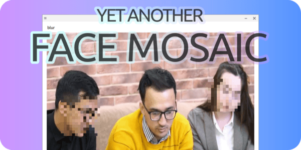
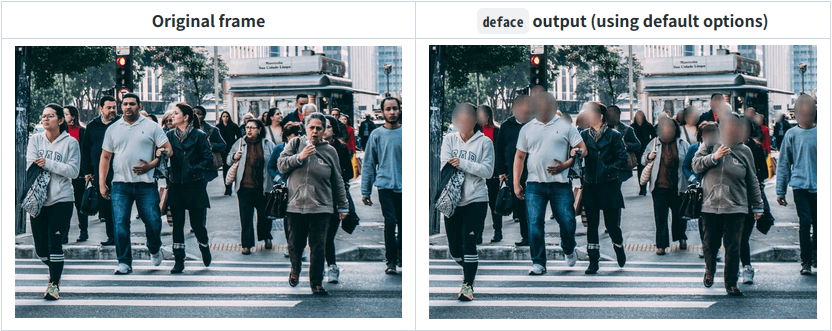
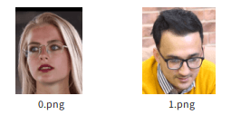
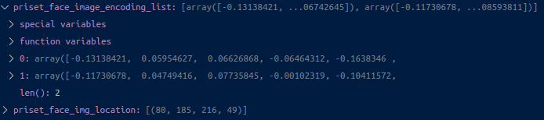
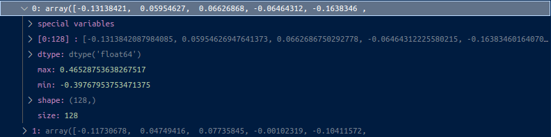
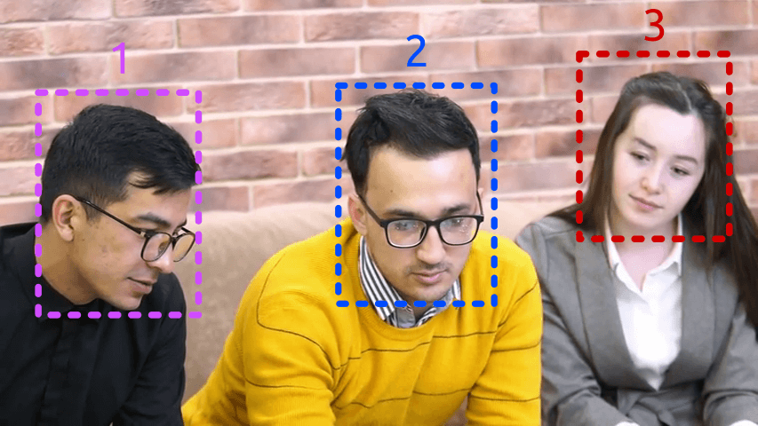

  
  
# YET ANOTHER FACE MOSAIC  
映像中の顔に対して特定人物以外にぼかし処理をかける  
  
# 動機
プライバシー保護のため顔領域にぼかし処理をかけたいけれど、あらかじめ登録した人物だけはぼかし処理をかけたくない。  
今まではこんな感じ。  

  
それに対してYET ANOTHER FACE MOSAICではこんな感じ。  
  
例えば[ORB-HD/deface](https://github.com/ORB-HD/deface)のように`centerface.onnx`を用いる場合`顔検出`"だけ"なので検出できうる限り全ての顔領域にぼかし処理を行う。こんな感じ。  
  
***ある映像に対して「自分の顔までモザイクがかかるのは嫌」という欲求があった場合、`顔検出`に加えて`顔認識`をしなくてはならない。***  
それを今回実装した。`dlib`を用いる。  
  
# 方法
ぼかし処理をしたくない顔を用意する。ここではknown_faceディレクトリの中に2つの顔画像を用意した。  
  
2つのファイルに対して以下のコードを用意する。
```python
# Encode face images in known_face directory
priset_face_image_encoding_list = []
for face in os.listdir('known_face'):
    pricet_face_img = face_recognition.load_image_file('known_face/' + face)
    priset_face_img_location = face_recognition.face_locations(pricet_face_img, 0, 'cnn')
    priset_face_image_encoding = face_recognition.face_encodings(pricet_face_img, priset_face_img_location, 10, 'small')
    priset_face_image_encoding_list.append(priset_face_image_encoding[0])
```
`priset_face_image_encoding_list配列`は以下の様なデータを持つ。  
  
要素の1つはこんな感じ。  
  
128次元配列になっている。  
こんな感じで2つの顔画像ファイルからエンコーディングデータを取り出しておく。  
  
次に映像の各フレームに対して`顔検出`を行い、顔の座標を得る。  
  
青で表示された2番の顔領域はぼかし処理をしたくない。3の顔領域はknown_faceディレクトリにあった女性とは違う顔。なのでぼかしを入れたい。これらを以下の様にコードする。  
```python
# Mosaicize only if a face is present
if len(face_locations) > 0:
    # このフレームにknown_faceディレクトリ内の人物が存在する時、flagはTrue
    flag = False
    # 同じフレーム内のそれぞれの顔領域についてぼかし処理を行う
    for (top, right, bottom, left) in face_locations:
        face_encoding = face_recognition.face_encodings(frame, [(top, right, bottom, left)], 0, 'small')
        for priset_face_image_encoding in priset_face_image_encoding_list:
            distance = face_recognition.face_distance(priset_face_image_encoding, face_encoding)
            if distance[0] < tolerance:
                flag = True
        if flag == False:
            # rectangle blur ======
            # dst[top:top + (bottom - top), left:left + (right - left)] = cv2.blur(dst[top:top + (bottom - top), left:left + (right - left)], (50, 50))
            # mosaic blur =========
            dst[top:top + (bottom - top), left:left + (right - left)] = mosaic(dst[top:top + (bottom - top), left:left + (right - left)], 0.1)
        flag = False
```
同一フレーム内の各顔領域座標（`for (top, right, bottom, left) in face_locations:`）に対して顔距離が`tolerance`より近ければ（`if distance[0] < tolerance:`）`flag`を`True`にする。`flag`が`False`の場合だけその領域にぼかし処理をさせればよい。  
これを全てのフレームで行う。  
  
全コードは以下の通り。  
動作させる環境によっては全てのフレームを処理させると遅延するかもしれないので`frame_drop`変数を用意した。指定した数値分だけフレームドロップする。  
```python
import os
import cv2
import face_recognition
import PySimpleGUI as sg

# Initial setting
tolerance = 0.5
frame_drop = 0

vcap = cv2.VideoCapture('img/video.mp4', cv2.CAP_FFMPEG)

# Mosaic function
def mosaic(src, ratio):
    small = cv2.resize(src, None, fx=ratio, fy=ratio, interpolation=cv2.INTER_NEAREST)
    return cv2.resize(small, src.shape[:2][::-1], interpolation=cv2.INTER_NEAREST)

# Make window layout
sg.theme('Reddit')
layout = [
    [sg.Text('blur')],
    [sg.Image(key='display')],
    [sg.Button('terminate', key='terminate', button_color='red')]
]
window = sg.Window('blur', layout, location=(50, 50), disable_close=True)

# Encode face images in known_face directory
priset_face_image_encoding_list = []
for face in os.listdir('known_face'):
    pricet_face_img = face_recognition.load_image_file('known_face/' + face)
    priset_face_img_location = face_recognition.face_locations(pricet_face_img, 0, 'cnn')
    priset_face_image_encoding = face_recognition.face_encodings(pricet_face_img, priset_face_img_location, 10, 'small')
    priset_face_image_encoding_list.append(priset_face_image_encoding[0])

# Process each frame
frame_counter = 0
while True:
    ret, frame = vcap.read()
    if ret == False:
        break
    # Frame drop process
    if frame_drop >= frame_counter:
        frame_counter += 1
        continue
    frame_counter = 0

    dst = frame.copy()

    face_locations = face_recognition.face_locations(frame, 0, 'cnn')

    # Mosaicize only if a face is present
    if len(face_locations) > 0:
        # このフレームにknown_faceディレクトリ内の人物が存在する時、flagはTrue
        flag = False
        # 同じフレーム内のそれぞれの顔領域についてぼかし処理を行う
        for (top, right, bottom, left) in face_locations:
            face_encoding = face_recognition.face_encodings(frame, [(top, right, bottom, left)], 0, 'small')
            for priset_face_image_encoding in priset_face_image_encoding_list:
                distance = face_recognition.face_distance(priset_face_image_encoding, face_encoding)
                if distance[0] < tolerance:
                    flag = True
            if flag == False:
                # rectangle blur ======
                # dst[top:top + (bottom - top), left:left + (right - left)] = cv2.blur(dst[top:top + (bottom - top), left:left + (right - left)], (50, 50))
                # mosaic blur =========
                dst[top:top + (bottom - top), left:left + (right - left)] = mosaic(dst[top:top + (bottom - top), left:left + (right - left)], 0.1)
            flag = False
            

    event, _ = window.read(timeout=1)
    imgbytes = cv2.imencode(".png", dst)[1].tobytes()
    window["display"].update(data=imgbytes)
    if event == sg.WIN_CLOSED or event == 'terminate':
        break
vcap.release()
window.close()
```
# 結果
  

期待通りの結果が得られました。

# Reference
- [ORB-HD/deface](https://github.com/ORB-HD/deface)
- [yKesamaru/face_mosaic](https://github.com/yKesamaru/face_mosaic)
- [【Zenn】動画の中の顔全てにモザイクをかける](https://zenn.dev/ykesamaru/articles/fe206cc8b27833)
# Author
yKesamaru
# License
MIT License